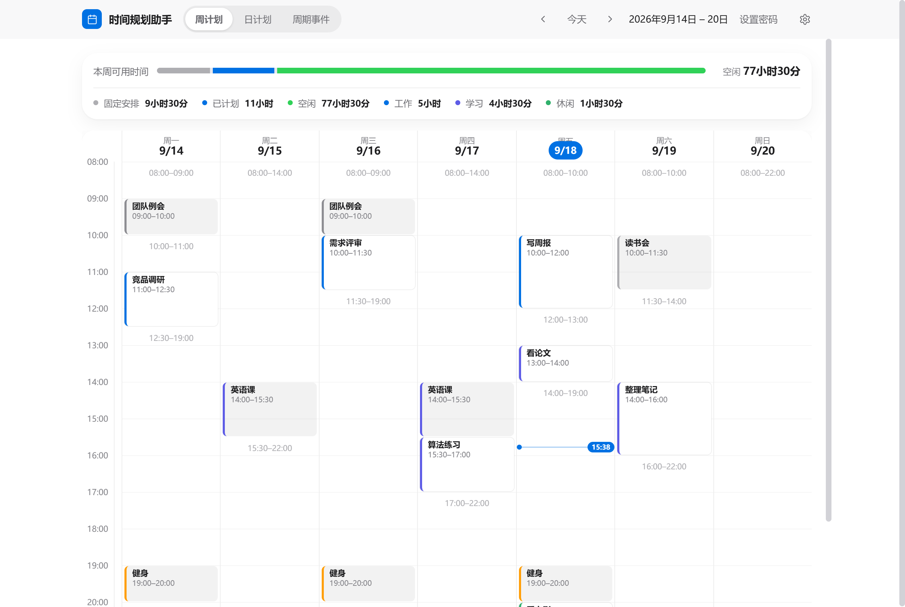
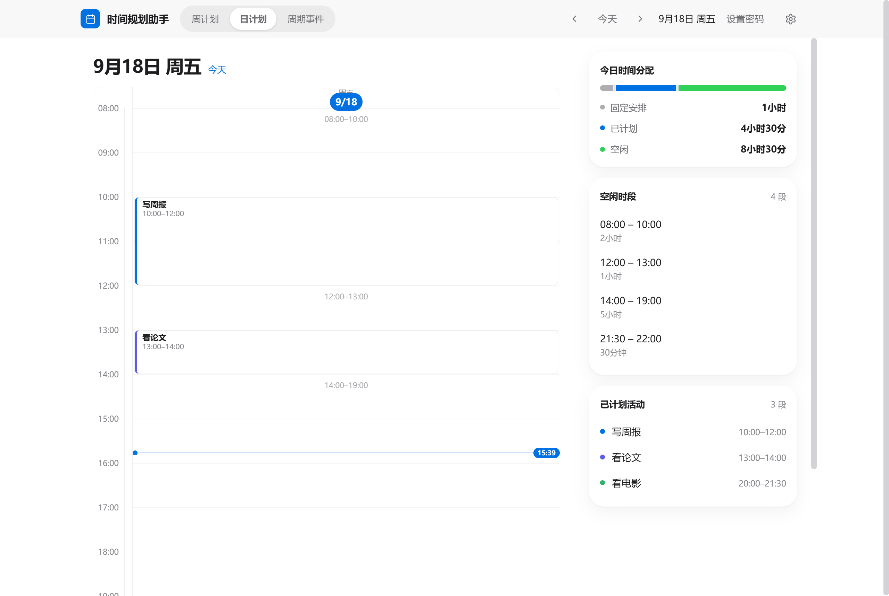
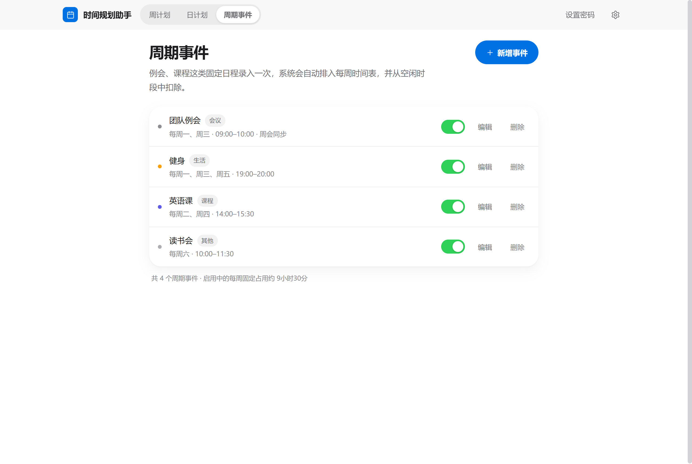

# 时间规划助手

一个本地运行的个人时间规划工具：录入固定重复的**周期事件**（例会、课程、健身等），系统自动生成每周时间表并识别所有**剩余空闲时段**；在空闲时段里自由安排工作、学习、休闲、个人事务，形成完整的**日计划**与**周计划**。

单个可执行文件、内嵌前端页面，启动后浏览器访问 `http://127.0.0.1:7777` 即可使用，**无需安装任何额外环境**，数据全部保存在本机。

## 界面预览

**周计划**：固定事件（实色块）、已安排活动（浅色块+分类色边）、空闲时段（虚线格）一目了然。



**日计划**：单日时间轴 + 今日统计、空闲时段一键安排、已计划活动列表。



**周期事件**：固定日程集中管理，支持启用/停用。



## 功能特性

- **周期事件**：每周重复的固定日程，可选星期、时间段、生效日期范围；支持启用/停用（停用后不参与时间表但保留配置）。
- **空闲时段识别**：在可配置的每日规划时段内，扣除周期事件与已安排活动，自动合并相邻时段，计算所有剩余空闲时间段。
- **周计划 / 日计划**：时间轴视图，点击空闲格子直接创建安排；今天高亮、当前时间红线指示、自动滚动定位。
- **冲突检测**：新安排与周期事件或其他安排时间重叠时拒绝保存，并给出具体冲突对象。
- **访问控制**：可设置管理密码——游客只能查看时间表，添加/修改/删除需要密码；未设置密码时行为与本机单人工具一致。
- **工单系统集成（tix）**：在设置里填写 tix 地址与 API Key，新建安排时可从「待处理工单」下拉中直接选择，工单内容自动填入事件名称（备注自动记录工单号、分类与发起人）。
- **分类与统计**：安排分工作 / 学习 / 休闲 / 个人事务四类配色；周、日两个维度的固定/已计划/空闲时长与分类占比。
- **隐私与离线**：只监听本机 127.0.0.1，纯本地存储，不联网。

## 快速开始

### 方式一：直接运行

```bat
timeplanner.exe
```

启动后自动打开浏览器（或手动访问 <http://127.0.0.1:7777>）。首次运行会在当前目录创建数据文件 `planner-data.json`。

### 方式二：一键构建（PowerShell）

```powershell
.\build.ps1              # 完整构建：前端 npm build + 后端 go build
.\build.ps1 -Run         # 构建完成后立即启动
.\build.ps1 -Clean       # 先清理 web/dist 与旧 exe，再完整构建
.\build.ps1 -SkipFrontend -Run   # 前端未改动时，只重编后端并启动
```

参数说明：

| 参数 | 说明 |
| --- | --- |
| `-SkipFrontend` | 跳过前端构建，直接编译后端（要求 `web/dist` 已存在） |
| `-SkipBackend` | 只构建前端 |
| `-Run` | 构建成功后立即启动服务（Ctrl+C 停止） |
| `-NoOpen` | 配合 `-Run`，启动时不自动打开浏览器 |
| `-Clean` | 构建前删除 `timeplanner.exe` 与 `web/dist` |
| `-Output <路径>` | 自定义后端输出文件名，默认 `timeplanner.exe` |

### 方式三：手动构建

依赖：Go ≥ 1.27、Node ≥ 20（含 npm）。

```bat
:: 1. 构建前端（产物输出到 web/dist，随后被嵌入二进制）
cd frontend
npm install
npm run build
cd ..

:: 2. 编译后端
go build -o timeplanner.exe .
```

### 命令行参数

| 参数 | 默认值 | 说明 |
| --- | --- | --- |
| `-port` | `7777` | HTTP 监听端口（如被占用可换其他端口） |
| `-host` | `127.0.0.1` | HTTP 监听地址；容器或局域网访问时用 `0.0.0.0` |
| `-data` | `planner-data.json` | 数据文件路径（相对路径基于工作目录） |
| `-password` | 空 | 管理密码：设置后写操作需密码、游客只读；**每次启动都会覆盖为该值**（也可不传，用页面设置） |
| `-no-open` | 关 | 启动后不自动打开浏览器 |

## Docker 部署

镜像由 GitHub Actions 自动构建并推送到 GHCR（仅 `linux/amd64`，构建机原生架构即目标架构，**不使用 QEMU 模拟**）：

- 推送到 `main` 分支 → `ghcr.io/<owner>/<repo>:latest`（另附 sha 短标签）
- 推送 `v*` 标签（如 `v1.0.0`）→ `ghcr.io/<owner>/<repo>:1.0.0` 与 `:1.0`
- 也可在 GitHub 仓库的 Actions 页面手动触发（workflow_dispatch）

镜像内数据文件固定在 `/data/planner-data.json`，把宿主机目录挂载到 `/data` 即可持久化：

```bash
docker run -d --name timeplanner \
  -p 7777:7777 \
  -v ./data:/data \
  -e TZ=Asia/Shanghai \
  ghcr.io/<owner>/timeplanner:latest
```

docker-compose.yml 示例：

```yaml
services:
  timeplanner:
    image: ghcr.io/<owner>/timeplanner:latest
    container_name: timeplanner
    ports:
      - "7777:7777"
    volumes:
      - ./data:/data
    environment:
      - TZ=Asia/Shanghai
    restart: unless-stopped
```

说明：

- 容器内默认以 `-host 0.0.0.0 -data /data/planner-data.json -no-open` 启动（见 Dockerfile `CMD`），可在镜像名后追加参数覆盖，例如 `-port 8080`。
- **设置管理密码**（推荐部署后立即做）：方式一，直接在页面右上角「设置密码」设置一次，哈希保存在挂载的 `/data` 数据文件中，重启不丢失；方式二，compose 里加 `command: ["-host","0.0.0.0","-data","/data/planner-data.json","-no-open","-password","你的密码"]`（注意该方式每次重启会覆盖页面里改的密码）。设置后游客只能查看。
- 时区默认 `Asia/Shanghai`，可用 `-e TZ=...` 调整；周表与“今天”均按容器本地时区计算。
- 首次发布的 GHCR 包默认为**私有**，可在仓库的 Packages 设置页改为 Public；同账号拉取无需额外配置。
- 本地有 Docker 时也可手动构建：`docker build -t timeplanner .`。

## 使用指南

### 周期事件（固定日程）

在「周期事件」页点击**新增事件**：填写名称、选择分类、勾选每周重复的日期、设定起止时间。可选设置**生效日期范围**（如学期、项目周期），留空表示长期有效。

周期事件分类：会议（蓝）、课程（紫）、健身（绿）、生活（橙黄）、其他（灰）。

- **停用**：开关切到灰色即停用，事件配置保留但不再排入时间表、不再占用空闲时段。
- **编辑**：在周计划视图直接点击事件块，或在「周期事件」页点「编辑」；修改对所有周生效。

### 安排活动（空闲时段规划）

三种入口创建安排：周计划里点任意虚线空闲格、日计划侧栏空闲列表点「安排」、或直接在周/日视图的既有安排上点击后修改。弹窗会预填日期与起止时间，可再调整。

安排分类：工作（靛蓝）、学习（青）、休闲（粉）、个人事务（橙）。名称可留空，保存后自动显示分类名。

### 空闲时段的计算规则

1. 取「设置」中的每日规划时段（默认 07:00–23:00，结束可到 24:00）作为窗口；
2. 扣除当日生效且启用的周期事件、当日所有已安排活动；
3. 重叠或相邻的忙段先合并，剩余窗口即空闲时段（周计划中显示为虚线格，日计划侧栏逐条列出）。

每日时段之外的安排仍会显示在时间轴上，但不参与空闲统计。

### 工单系统集成（tix）

与 [tix 工单系统](https://github.com/cn-maul/tix)（或任意兼容其 API 的部署）打通后，新建安排时可从待处理工单中一键选择：

1. **tix 侧**：管理员在「系统设置 → 通用设置 → 集成 API Key」点击生成，复制 Key；
2. **本系统**：设置 → 工单系统集成，填写 tix 地址（如 `http://192.168.1.10:8881`）与 API Key，「测试连接」通过后保存；
3. **使用**：新建/编辑安排时，顶部出现「从工单导入」下拉，列出 tix 全部待处理工单（`status=0`）；选中后**工单内容自动填入名称**，备注自动记录 `工单 #编号 · 分类 · 发起人`。

说明：

- 请求由本系统后端代理发往 tix（附带 `X-API-Key` 头），浏览器不直接接触 Key，访客也无法触达；拉取/测试接口均需管理鉴权。
- Key 属敏感信息，仅以哈希无关的原文存于本机数据文件，任何 API 都不会下发。
- 每次拉取最多返回 100 条待处理工单（按编号倒序）。

### 访问控制（游客只读 / 管理密码）

设置管理密码后，页面进入双角色模式：

- **游客**（未登录）：三个视图均可查看（时间表、空闲时段、统计），但没有任何编辑入口——空闲格不可点击、新增/编辑/删除按钮隐藏；直接调用写接口会收到 401。
- **管理员**：点右上角「管理员登录」输入密码，之后所有编辑功能可用（浏览器会记住密码）；提供「修改密码」「退出」。

设置密码的两种方式：

1. **页面设置**：未设密码时右上角有「设置密码」按钮，设置一次即生效（哈希存入数据文件）；
2. **启动参数**：`timeplanner.exe -password 你的密码`，适合 Docker/无头部署。注意每次启动都会把密码覆盖为该参数值——在页面里改过密码后，请同步更新参数或去掉参数。

未设置密码时不做任何拦截（本机单人使用体验不变）。密码在数据文件中以「随机盐 + SHA-256」存储，不存明文；这是面向个人/小团队场景的基础防护，请勿使用弱密码并将其暴露在不可信网络中。

### 冲突规则

新增或修改安排时，若与「当日生效的周期事件」或「同日其他安排」时间重叠，服务端返回 409 并提示具体冲突对象；编辑自身时不会与自己冲突。周期事件之间允许重叠（例如课程与例会撞车会同时显示，空闲计算按并集扣除）。

## 数据与备份

所有数据保存在单个 JSON 文件（默认 `planner-data.json`，与 exe 同目录或 `-data` 指定位置），纯文本、可直接备份、同步、迁移。换电脑只需拷贝 exe 与数据文件两个文件。

```json
{
  "version": 1,
  "settings": { "dayStart": "07:00", "dayEnd": "23:00" },
  "events": [
    {
      "id": "07418c4be8e36ab7",
      "title": "团队例会",
      "category": "meeting",
      "weekdays": [1],
      "start": "09:00", "end": "10:30",
      "from": "", "to": "",
      "notes": "",
      "enabled": true
    }
  ],
  "blocks": [
    {
      "id": "98ebdadf9e3751a9",
      "date": "2026-08-31",
      "start": "11:00", "end": "12:00",
      "title": "写周报",
      "category": "work",
      "notes": ""
    }
  ]
}
```

| 字段 | 说明 |
| --- | --- |
| `settings.dayStart` / `dayEnd` | 每日规划时段窗口，`HH:MM`，结束支持 `24:00` |
| `events[].weekdays` | 重复的星期，`1`=周一 … `7`=周日 |
| `events[].from` / `to` | 生效日期范围（含两端），空表示长期有效 |
| `events[].enabled` | 停用为 `false`，不参与时间表 |
| `blocks[].date` | 单次安排所属日期 `YYYY-MM-DD` |
| `passwordSalt` / `passwordHash` | 管理密码的盐与哈希（SHA-256），空表示未启用访问控制 |
| `integration.ticketUrl` / `ticketKey` | tix 工单系统地址与 API Key；`ticketUrl` 为空表示未启用工单集成 |

## API 文档

后端同时提供 JSON API（前端亦由其驱动），均返回 UTF-8 JSON；出错时返回 `{"error": "原因"}`。

设置了管理密码后，除 GET 与 `/api/login` 外的所有接口都要求请求头 `X-Admin-Password: <密码>`，缺失或错误返回 **401**；未设置密码时无需鉴权。

| 方法 | 路径 | 成功码 | 说明 |
| --- | --- | --- | --- |
| GET | `/api/week?date=YYYY-MM-DD` | 200 | 返回该日期所在一周（周一开始）的完整时间表；省略 `date` 为本周 |
| GET | `/api/events` | 200 | 列出全部周期事件（按星期与开始时间排序） |
| POST | `/api/events` | 201 | 新增周期事件 🔒 |
| PUT | `/api/events/{id}` | 200 | 修改周期事件 🔒 |
| DELETE | `/api/events/{id}` | 200 | 删除周期事件 🔒 |
| POST | `/api/blocks` | 201 | 新增单次安排；时间冲突返回 **409** 🔒 |
| PUT | `/api/blocks/{id}` | 200 | 修改安排（排除自身后校验冲突） 🔒 |
| DELETE | `/api/blocks/{id}` | 200 | 删除安排 🔒 |
| GET / PUT | `/api/settings` | 200 | 每日规划时段与工单集成配置；GET 额外返回 `passwordSet`、`ticketUrl`、`ticketKeySet` 🔒 |
| POST | `/api/login` | 200 | 校验管理密码，正确返回 `{"ok":true}` |
| POST | `/api/password` | 200 | 设置/修改管理密码（body `{"next":"新密码"}`） 🔒 |
| GET | `/api/integration/tickets` | 200 | 拉取 tix 待处理工单列表 🔒 |
| POST | `/api/integration/tickets/test` | 200 | 工单系统集成连接测试（body 可选传表单配置） 🔒 |

🔒 = 设置管理密码后需要 `X-Admin-Password` 请求头。

示例（PowerShell，避免命令行中文编码问题推荐用 `Invoke-RestMethod`）：

```powershell
# 新增周期事件：每周一 09:00-10:30 例会
Invoke-RestMethod -Method Post -Uri http://127.0.0.1:7777/api/events `
  -ContentType 'application/json; charset=utf-8' -Body ([System.Text.Encoding]::UTF8.GetBytes(
  '{"title":"团队例会","category":"meeting","weekdays":[1],"start":"09:00","end":"10:30","enabled":true}'))

# 查看某周时间表（含 events / blocks / free / stats）
$week = Invoke-RestMethod 'http://127.0.0.1:7777/api/week?date=2026-08-31'
$week.days[0].free          # 周一的空闲时段列表

# 与固定事件冲突时返回 409
try { Invoke-RestMethod -Method Post -Uri http://127.0.0.1:7777/api/blocks -ContentType 'application/json' -Body '{"date":"2026-08-31","start":"10:00","end":"11:00","title":"x","category":"work"}' }
catch { $_.ErrorDetails.Message }   # {"error":"与周期事件「团队例会」(09:00–10:30) 时间冲突"}
```

错误码约定：`400` 参数不合法（时间格式、起止顺序、日期格式等）；`404` 目标不存在；`409` 时间冲突；`500` 服务器内部错误。

## 目录结构

```
├─ main.go              启动入口：命令行参数、HTTP 服务、自动打开浏览器
├─ store.go             数据模型与 JSON 存储、参数校验、冲突检测
├─ slots.go             时间解析、周表生成、空闲时段计算（合并忙段→窗口求余）
├─ server.go            REST API 路由、panic 恢复、静态资源服务（SPA 回退）
├─ go.mod               Go 模块定义（无第三方依赖）
├─ web/
│  ├─ embed.go          go:embed 内嵌前端构建产物
│  └─ dist/             前端构建输出（npm run build 生成，勿手改）
├─ frontend/            React 前端源码
│  ├─ src/App.tsx       应用骨架：视图切换、周/日导航、弹窗与 toast 编排
│  ├─ src/api.ts        后端 API 封装
│  ├─ src/types.ts      与后端对应的类型定义
│  ├─ src/constants.ts  分类配色体系
│  ├─ src/util.ts       时间/日期工具（HH:MM ↔ 分钟、周边界等）
│  └─ src/components/
│     ├─ WeekGrid.tsx   时间轴网格（时间刻度、空闲格、重叠条目分列布局、当前时间线）
│     ├─ DayView.tsx    日视图（时间轴 + 统计/空闲/已计划侧栏）
│     ├─ EventsView.tsx 周期事件管理页
│     ├─ EventDialog.tsx / BlockDialog.tsx   周期事件与安排的表单弹窗
│     ├─ SettingsDialog.tsx                  每日规划时段设置
│     └─ ui.tsx         通用组件（Modal、Field 等）
├─ build.ps1            一键构建脚本（前端 + 后端，支持 -Run/-Clean 等参数）
├─ Dockerfile           三阶段构建：Node 构建前端 → Go 编译 → Alpine 运行镜像
├─ .dockerignore        缩减构建上下文（排除 node_modules、exe、文档等）
├─ .github/workflows/docker.yml   CI：构建 linux/amd64 镜像并推送 GHCR
└─ docs/images/         README 截图
```

## 开发指南

前后端分离开发：先起后端，再起 Vite 开发服务器（已配置 `/api` 代理到 7777，支持热更新）：

```bat
go run . -no-open
cd frontend && npm run dev     :: 默认 http://localhost:5173
```

实现要点：

- **零依赖后端**：路由使用 Go 1.22+ 的方法+路径模式（`PUT /api/events/{id}`），静态资源用 `http.FileServerFS`，未命中路径回退 `index.html`（SPA）。
- **前端嵌入**：`frontend` 构建输出到 `web/dist`，由 `web/embed.go` 以 `go:embed all:dist` 打进二进制；因此必须先构建前端再编译后端。
- **时间处理**：日期一律 `YYYY-MM-DD` 本地时区、时刻一律 `HH:MM`（分钟数计算），`24:00` 视为 1440 分钟，避免时区换算问题。
- **并发模型**：单进程内 `sync.RWMutex` 保护数据，写入走「临时文件 + 原子重命名」。

## 常见问题

**启动时报端口被占用？**
用 `-port` 换端口，例如 `timeplanner.exe -port 8080`。

**忘记管理密码怎么办？**
用 `-password 新密码` 重新启动即可覆盖重置（该参数每次启动都会生效）；Docker 部署同样在启动参数里加 `-password`。

**如何换电脑 / 备份？**
拷贝 exe 与 `planner-data.json` 两个文件即可；也可用 `-data` 指定网盘/仓库内的路径集中管理。

**浏览器没有自动打开？**
用 `-no-open` 启动会跳过自动打开；或系统不支持时手动访问 `http://127.0.0.1:7777`。

**停用和删除周期事件有什么区别？**
停用保留配置，随时可重新启用，适合学期结束的课程；删除不可恢复（其已创建的单次安排不受影响）。

**为什么某个周期事件没有从空闲时段中扣除？**
检查三点：事件是否处于停用状态、是否超出生效日期范围、时间是否落在每日规划时段窗口之外。

**结束时间可以填 24:00 吗？**
可以。开始时间最晚 23:59，结束时间支持 `24:00`（午夜）。

**修改了源码如何重新出包？**
在项目根目录运行 `.\build.ps1`；只改了 Go 代码时用 `.\build.ps1 -SkipFrontend` 更快。
